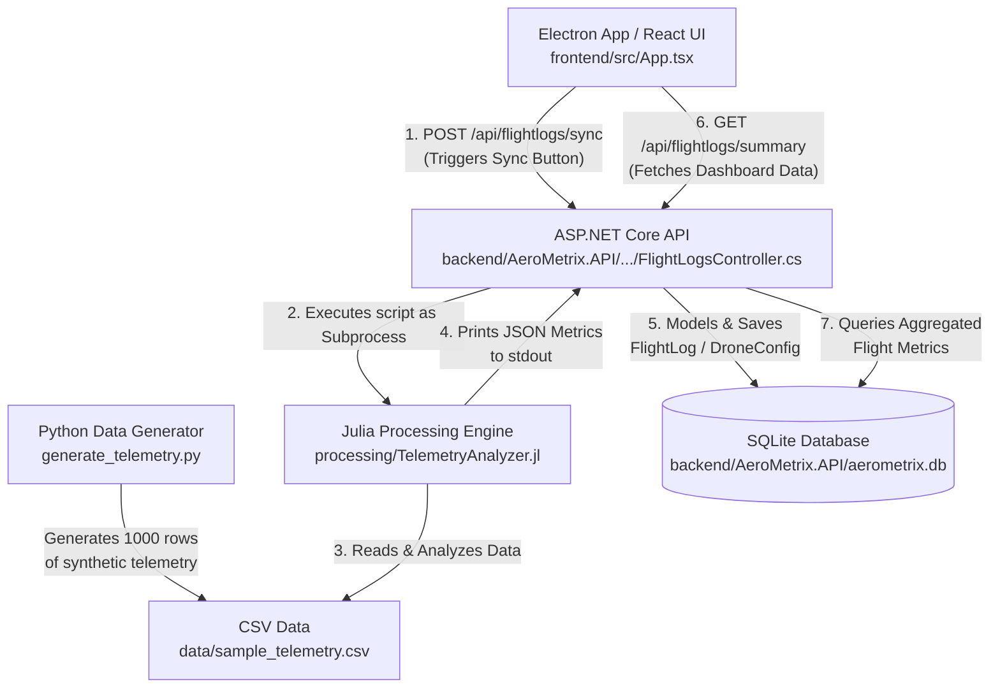

# AeroMetrix Project Architecture

This document describes the flow of data, control mechanisms, and the roles of specific codebase files within the AeroMetrix drone telemetry application.

## Data & Control Flow Diagram

## Component Breakdown

1. **Synthetic Data Generator** (`generate_telemetry.py`)
   - **Role:** Simulates the drone. Uses Python (`pandas` & `numpy`) to output 1,000 rows of simulated drone flight telemetry (airspeed, groundspeed, battery voltage, motor current with random noise).
   - **Outputs to:** `data/sample_telemetry.csv`

2. **Frontend Applications & UI** (`frontend/src/App.tsx`)
   - **Role:** The cross-platform user interface (React packed in an Electron shell via `frontend/electron/`).
   - **Flow:** Displays Active Fleet numbers, Avg Battery Drain, and a large Area chart. Uses `@tanstack/react-query` to pull data from the API's `/summary` endpoint continually. Sends out command to the API's `/sync` endpoint when the user hits "Sync Flight Logs."

3. **Backend Logic Controller** (`backend/AeroMetrix.API/Controllers/FlightLogsController.cs`)
   - **Role:** The central router uniting the Julia calculations with data storage.
   - **Flow:** 
     - **Sync (`POST /sync`):** Spawns a background OS process to run the executable Julia script, capturing its mathematical JSON output. It then deserializes the JSON, applies small randomized jitter (for visual effect on the chart), and creates a `FlightLog` entity mapped to a `DroneConfiguration`.
     - **Summary (`GET /summary`):** Punts calculations logic down to Entity Framework Core commands to compute real-time aggregates from the SQLite DB and respond gracefully to UI.

4. **Data Processing Engine** (`processing/TelemetryAnalyzer.jl`)
   - **Role:** Fast, math-intensive numeric operations handled in Julia.
   - **Flow:** Takes the filepath parameter to `data/sample_telemetry.csv`. Computes averages and maximums (e.g., subtracting groundspeed from airspeed for wind resistance). Prints the final dictionary out as pure JSON so C# can intercept it.

5. **Storage / Database** (`backend/AeroMetrix.API/aerometrix.db`)
   - **Role:** The long-lived persistent storage engine utilizing SQLite. Ensures historical flight data remains structured according to classes located in `backend/AeroMetrix.API/Models/` (like `FlightLog.cs` and `DroneConfiguration.cs`).
